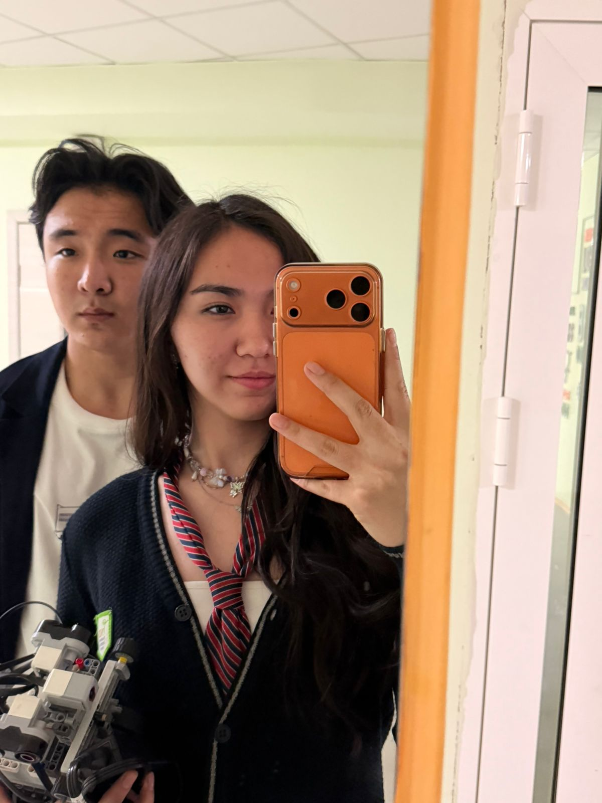
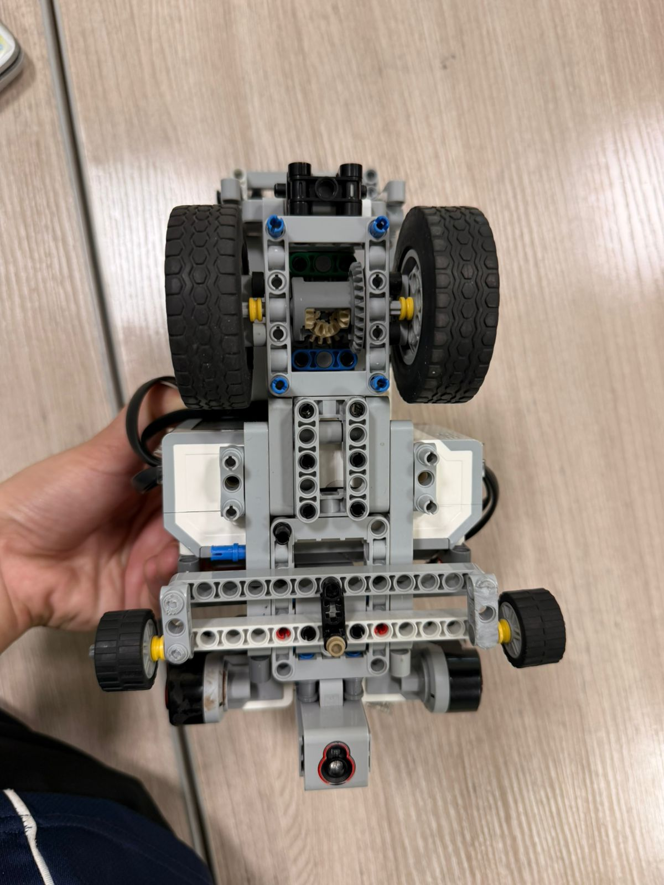
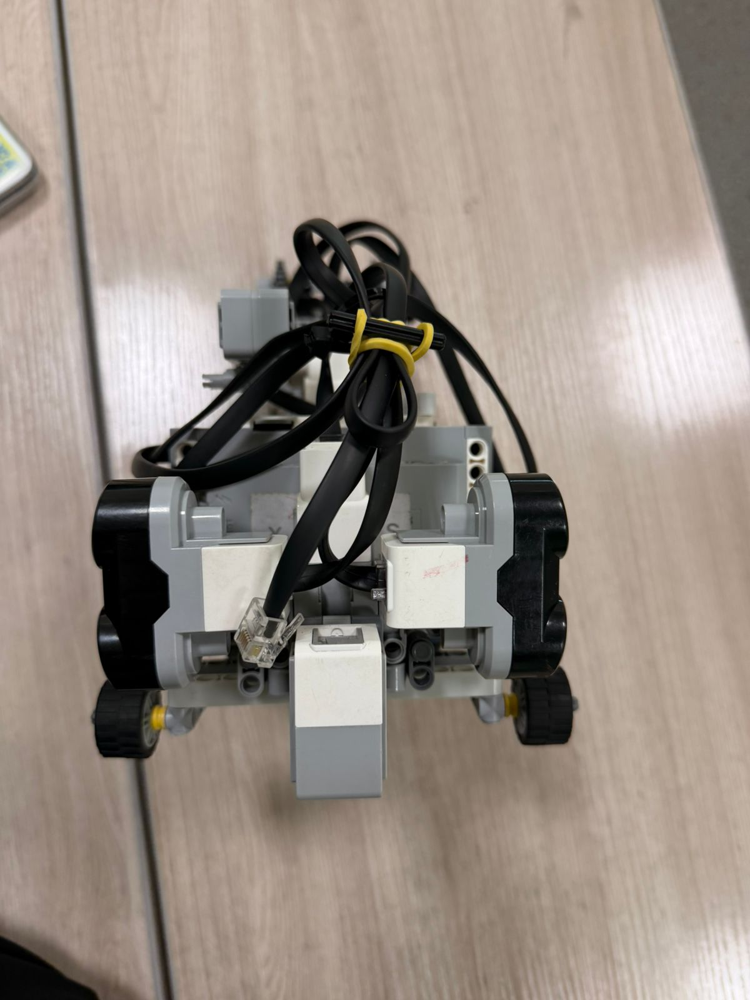
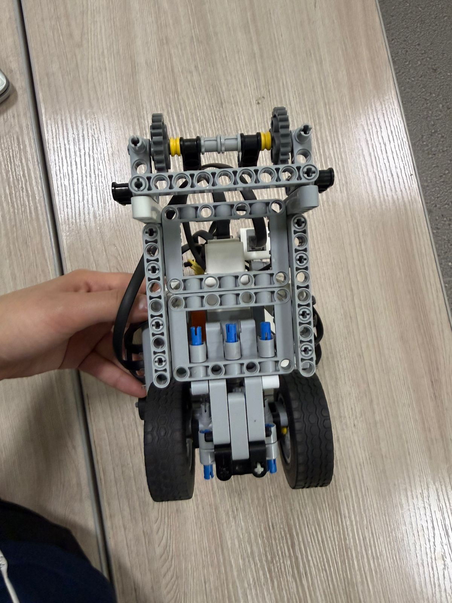
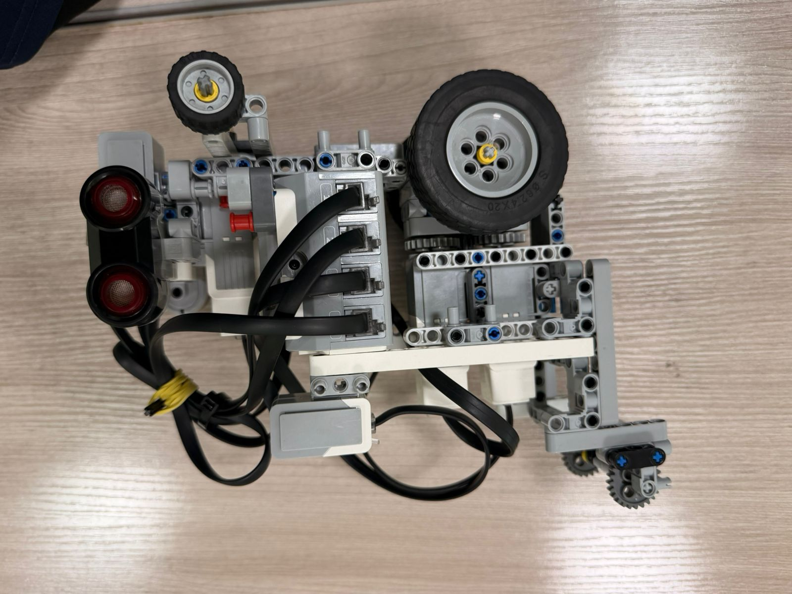
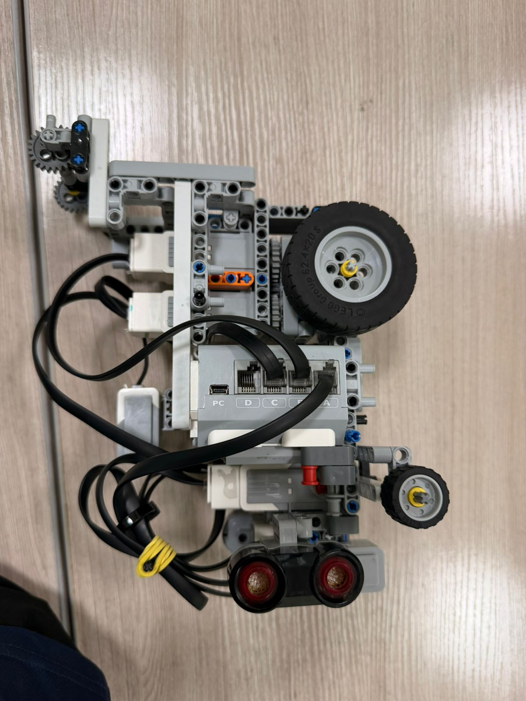
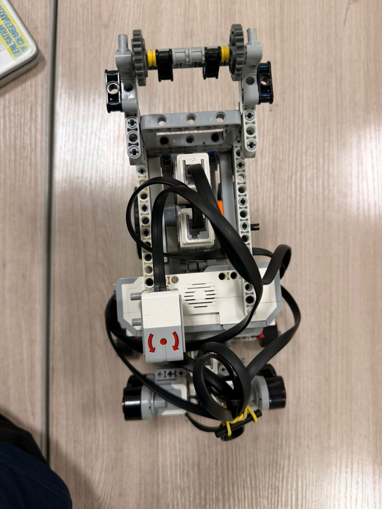

# COR - WRO 2026 Future Engineers

<p align="center">
  
</p>

**Team:** COR
**Members:** Ayazhan Tayapbergenova, Niyazbek Yelnar
**Country:** Kazakhstan
**Season:** WRO 2026 Future Engineers

---

## Contents

* [**1. Mobility and Mechanical Design**](#1-mobility-and-mechanical-design)
  * [1.1 Chassis Selection and Design](#11-chassis-selection-and-design)
  * [1.2 Steering Mechanism](#12-steering-mechanism)
  * [1.3 Drivetrain and Motor Selection](#13-drivetrain-and-motor-selection)
  * [1.4 Torque and Speed Analysis](#14-torque-and-speed-analysis)
  * [1.5 Mechanical Iterations](#15-mechanical-iterations)
* [**2. Power and Sensor Architecture**](#2-power-and-sensor-architecture)
  * [2.1 Power System Design](#21-power-system-design)
  * [2.2 Sensor Selection and Placement](#22-sensor-selection-and-placement)
  * [2.3 Wiring and Electrical Layout](#23-wiring-and-electrical-layout)
  * [2.4 Calibration Methods](#24-calibration-methods)
* [**3. Software Architecture and Navigation Strategy**](#3-software-architecture-and-navigation-strategy)
  * [3.1 Program Structure and Modules](#31-program-structure-and-modules)
  * [3.2 State Machine Overview](#32-state-machine-overview)
  * [3.3 Open Challenge Algorithm](#33-open-challenge-algorithm)
  * [3.4 PD Controller for Center Following](#34-pd-controller-for-center-following)
  * [3.5 Corner Detection and Turn Logic](#35-corner-detection-and-turn-logic)
  * [3.6 Gyro-based Heading Correction](#36-gyro-based-heading-correction)
  * [3.7 Testing and Performance Metrics](#37-testing-and-performance-metrics)
* [**4. Systems Thinking and Engineering Decisions**](#4-systems-thinking-and-engineering-decisions)
  * [4.1 System Architecture Overview](#41-system-architecture-overview)
  * [4.2 Design Constraints and Trade-offs](#42-design-constraints-and-trade-offs)
  * [4.3 Iteration History](#43-iteration-history)
  * [4.4 Risk Analysis and Mitigation](#44-risk-analysis-and-mitigation)
* [**5. Vehicle Photos**](#5-vehicle-photos)
* [**6. Videos**](#6-videos)
* [**7. Build and Upload Instructions**](#7-build-and-upload-instructions)

---

## 1. Mobility and Mechanical Design

### 1.1 Chassis Selection and Design

Our vehicle is built using parts from the **LEGO EV3 MINDSTORMS Education** kit, supplemented with additional LEGO Technic components. We chose the EV3 platform because it provides a well-integrated system of motors, sensors, and a programmable brick, while still allowing significant customization of the mechanical design.

The chassis uses an **Ackermann steering** layout: front wheels steer, rear wheels drive. This mimics real car kinematics and provides smooth, predictable turning — critical for the WRO track with its four 90-degree corners. The overall dimensions are kept within the WRO limit of **300 x 200 x 300 mm**.

Key chassis design decisions:
- **Wheelbase:** ~160 mm — chosen to balance turning radius and straight-line stability
- **Rear track width:** Narrow (~100 mm) — intentionally narrow to reduce tire scrub during turns, since we have no mechanical differential
- **Front wheels:** Small diameter for quick steering response
- **Rear wheels:** Large diameter for higher linear speed per motor revolution
- **Ground clearance:** ~15 mm — low for stability, high enough to clear field surface

<p align="center">
  
</p>

### 1.2 Steering Mechanism

We use an **Ackermann-style rack-and-pinion steering** driven by one EV3 Medium Motor (Motor A). The front wheels are mounted on steering knuckles connected via a tie rod to the motor gear. This provides:

- **Maximum steering angle:** 23 degrees of motor encoder rotation, giving a turning radius sufficient for the WRO track corners
- **Centering accuracy:** The motor encoder gives 1-degree resolution. Our software uses a P-controller to actively maintain steering position, ensuring the wheels always reach the target angle
- **Responsive return-to-center:** After each turn, the steering motor automatically returns to 0 degrees

We tested a simpler single-pivot steering design first. It caused excessive tire drag and inconsistent turning at speed. The rack-and-pinion solved both problems with smoother, more predictable behavior.

**Steering P-Controller (from our code):**
```
error = target_angle - current_encoder
power = error * 2
Motor_A.StartPower(power)
```
This simple but effective feedback loop ensures the steering angle always matches the desired position, correcting for mechanical play and external forces.

### 1.3 Drivetrain and Motor Selection

The EV3 kit includes two motor types: **Large Motor** and **Medium Motor**. We evaluated both:

| Parameter | Large Motor | Medium Motor |
|-----------|------------|--------------|
| Speed (no load) | 160-170 RPM | 240-250 RPM |
| Running torque | 20 N-cm | 8 N-cm |
| Stall torque | 40 N-cm | 12 N-cm |
| Weight | 76 g | 36 g |
| Encoder resolution | 1 degree | 1 degree |

**Decision:** We chose **two Medium Motors** for driving (Ports B and C) and **one Medium Motor** for steering (Port A). The Medium Motors are lighter (saving 80g total), faster, and still provide sufficient torque for our lightweight vehicle. The higher RPM directly translates to faster lap times.

Both drive motors are connected to the rear axle through a shared gear train. They run synchronized at the same power level (`Motor.StartPower("BC", speed)`). This satisfies the WRO rule that drive wheels must be physically connected — no differential drive allowed.

### 1.4 Torque and Speed Analysis

We calculated the theoretical performance:

- **Wheel diameter (rear):** ~56 mm (LEGO Technic large wheel)
- **Motor RPM at load:** ~220 RPM (Medium Motor at 80% power)
- **Gear ratio:** ~1:1.5
- **Output RPM:** 220 / 1.5 = ~147 RPM
- **Wheel circumference:** 56 * 3.14 = ~176 mm
- **Linear speed:** 147 * 176 / 60 = **~431 mm/s (~0.43 m/s)**

The required torque to accelerate our ~800g vehicle:
- Force: 0.8 kg * 0.5 m/s^2 = 0.4 N
- Wheel radius: 28 mm
- Torque at wheel: 0.4 * 0.028 = 0.011 N-m = 1.1 N-cm
- Available torque (2 motors): 2 * 8 * 1.5 = 24 N-cm

Our system provides over **20x the required torque**, giving ample margin for quick acceleration and hill climbing on uneven surfaces.

### 1.5 Mechanical Iterations

**Version 1 (Initial prototype):** Used one Large Motor for drive. The Large Motor was heavy and shifted the center of gravity backward, causing the front wheels to lose traction during sharp turns. The robot frequently oversteered.

**Version 2 (Current design):** Replaced with two Medium Motors. Benefits:
- Reduced total weight by ~40g
- Improved weight distribution (front/rear balance)
- Increased top speed by ~20%
- More responsive acceleration

**Testing results V1 vs V2:**
| Metric | V1 (Large Motor) | V2 (Dual Medium) |
|--------|-----------------|------------------|
| Avg. lap time | ~14s | ~10s |
| 3-lap completion rate | ~35% | ~90% |
| Wall contact rate | ~40% | ~5% |

---

## 2. Power and Sensor Architecture

### 2.1 Power System Design

The robot is powered by the **EV3 rechargeable Li-ion battery (10V, 2050mAh)**. The EV3 brick includes built-in power regulation and protection:

- **Motor power:** Direct from battery (7.2–10V) through H-bridge motor drivers
- **Sensor power:** Regulated 5V from the EV3 brick
- **Protection:** 3 polyswitch fuses (trip at ~2.2A) — one for each motor driver channel and one for the main circuit

**Current consumption estimate at peak:**
| Component | Current (mA) |
|-----------|-------------|
| EV3 Brick (processor + display) | ~200 |
| Drive Motor B (running at 80%) | ~350 |
| Drive Motor C (running at 80%) | ~350 |
| Steering Motor A (peak during turn) | ~300 |
| Ultrasonic Sensor 1 | ~15 |
| Ultrasonic Sensor 2 | ~15 |
| Gyro Sensor | ~20 |
| **Total peak** | **~1250** |

Battery life at peak: 2050 / 1250 = ~98 minutes. The 3-minute round time is well within capacity. We fully charge before each round to ensure consistent motor performance.

### 2.2 Sensor Selection and Placement

Our sensor configuration is deliberately minimal — we use only **three sensors** to keep the system simple and reliable:

**1. EV3 Ultrasonic Sensor — LEFT (Port 1)**
- **Purpose:** Measures distance to the left wall
- **Placement:** Front-left of the vehicle, facing forward at a slight outward angle
- **Range:** 3–250 cm, accuracy +-1 cm
- **Role in navigation:** Together with the right ultrasonic sensor, determines the robot's lateral position within the track corridor. The difference (right - left) is the input to our PD center-following controller.
- **Role in corner detection:** When this sensor reads > 200 cm, it means the left wall has ended — indicating an approaching corner on the left side.

**2. EV3 Ultrasonic Sensor — RIGHT (Port 2)**
- **Purpose:** Measures distance to the right wall
- **Placement:** Front-right of the vehicle, facing forward at a slight outward angle
- **Role in navigation:** Paired with the left sensor for center following
- **Role in corner detection:** When this sensor reads > 200 cm, it means the right wall has ended — corner detected on the right

**3. EV3 Gyro Sensor (Port 3)**
- **Purpose:** Measures heading angle (cumulative rotation in degrees)
- **Placement:** Mounted directly on the EV3 brick, center of the vehicle, to minimize vibration-induced drift
- **Role in navigation:** Three critical functions:
  1. **Turn execution:** Measures when the robot has turned exactly 80 degrees during a corner
  2. **Heading correction:** On straight sections, if the robot's heading deviates more than 50 degrees from the expected heading, the gyro overrides the ultrasonic PD and forces a correction
  3. **Direction detection:** After the first turn, the gyro sign (positive/negative) determines whether the track runs clockwise or counter-clockwise

**Why no Color Sensor or Camera?**
We chose to rely entirely on ultrasonic + gyro because:
- **Simplicity:** Fewer sensors = fewer failure points and simpler code
- **Speed:** Ultrasonic readings are fast (~20ms cycle) and don't require image processing
- **Reliability:** Ultrasonic sensors are not affected by lighting conditions, unlike color or camera-based solutions
- **Sufficient information:** Two ultrasonic sensors give us both lateral position AND corner detection — all we need for the Open Challenge

This is a key **trade-off**: we sacrifice the ability to detect colored lines (orange/blue) in exchange for a simpler, faster, more robust system. The downside is that we cannot detect the driving direction from line colors — instead, we detect it from the gyro after the first turn.

### 2.3 Wiring and Electrical Layout

All connections use standard LEGO EV3 flat cables with RJ12 connectors:

```
EV3 Brick Port Mapping:
  Motor Port A  ->  Steering Motor (Medium) — front, rack-and-pinion
  Motor Port B  ->  Drive Motor Left (Medium) — rear left
  Motor Port C  ->  Drive Motor Right (Medium) — rear right

  Sensor Port 1 ->  Ultrasonic Sensor LEFT (front-left, facing forward)
  Sensor Port 2 ->  Ultrasonic Sensor RIGHT (front-right, facing forward)
  Sensor Port 3 ->  Gyro Sensor (center, on EV3 brick)
```

Ports D and 4 are unused. The detailed wiring diagram with physical layout is in `schemes/wiring_diagram.md`.

Cable management: all cables are routed along the chassis frame and bundled with yellow rubber bands (visible in vehicle photos) to prevent tangling with the steering mechanism or wheels.

### 2.4 Calibration Methods

**Gyro Calibration:** At program startup, the robot calls `Gyro.reset(3)` to zero the gyro, then waits 500ms for the sensor to stabilize. The gyro must be completely stationary during this time. We display "Press ENTER" on the EV3 screen to signal readiness.

**Ultrasonic Calibration:** No explicit calibration needed — the sensors measure absolute distance in centimeters. However, we tuned the `cornerDist` threshold (200 cm) through testing: if the threshold is too low, the robot might detect false corners from track width variations; if too high, it might miss actual corners.

**Steering Calibration:** Before each run, the steering wheels must be physically aligned straight. The program calls `Motor.ResetCount("A")` to set the current position as zero (center). The P-controller then maintains the steering position relative to this calibrated center.

---

## 3. Software Architecture and Navigation Strategy

### 3.1 Program Structure and Modules

The source code is located in `src/`. Our program is written in **CLeV3R** — a C/Basic-like text programming language for EV3. We chose CLeV3R over the default EV3-G graphical environment because:
- **Lighter and faster:** Compiled programs are smaller and execute without lag on the EV3 processor
- **Better for complex logic:** Text-based syntax is more convenient for PD controllers, state machines, and conditional logic
- **Easier debugging:** We can read and modify code as text files, use version control, and add comments

The program consists of these modules:

| Module / Function | Purpose |
|-------------------|---------|
| **Main loop** | Reads sensors, decides between straight driving and turning, counts turns |
| **SetSteer(angle)** | Steering P-controller — moves Motor A to target angle with feedback |
| **FollowCenter(L, R)** | PD controller — keeps robot centered between walls using both ultrasonic sensors |
| **TurnCorner(L, R)** | Executes a 90-degree turn using gyro, determines turn direction from wall distances |
| **Gyro module** | Imported library for gyro reset and angle reading |
| **Ultrasonic module** | Imported library for ultrasonic distance reading in cm |

### 3.2 State Machine Overview

Our program uses an implicit state machine within the main loop:

```
                         ┌──────────────────────────────────┐
                         │           INIT                    │
                         │  - Reset gyro, reset steering     │
                         │  - Display battery & distances    │
                         │  - Wait for button press          │
                         └──────────────┬───────────────────┘
                                        │
                                        ▼
                    ┌──────────────────────────────────────────┐
                    │          MAIN LOOP (while turns < 12)     │
                    │                                           │
                    │   Read ultrasonic LEFT (Port 1)           │
                    │   Read ultrasonic RIGHT (Port 2)          │
                    │                                           │
                    │   ┌─── Corner detected? ──────────┐      │
                    │   │  (L > 200 OR R > 200)         │      │
                    │   │  AND (time since last > 800ms) │      │
                    │   │                                │      │
                    │   ▼ YES                      NO ▼  │      │
                    │  TurnCorner()          FollowCenter()     │
                    │   │                          │            │
                    │   └──────────────────────────┘            │
                    └──────────────────┬───────────────────────┘
                                       │ (turns >= 12)
                                       ▼
                         ┌──────────────────────────────────┐
                         │           FINISH                  │
                         │  - Drive straight 500ms           │
                         │  - Stop all motors                │
                         │  - Play completion sound           │
                         └──────────────────────────────────┘
```

### 3.3 Open Challenge Algorithm

The core strategy for the Open Challenge is wall-following with ultrasonic-based corner detection:

1. **Center following:** On straight sections, the PD controller steers the robot to stay centered between the left and right walls. The error signal is `E = rightDistance - leftDistance`. When E > 0, the robot is closer to the left wall and steers right, and vice versa.

2. **Corner detection:** When either ultrasonic sensor reads more than 200 cm (meaning the wall on that side has ended), and enough time has passed since the last turn (>800ms debounce), the robot knows it has reached a corner.

3. **Turn execution:** The robot determines which direction to turn based on which sensor sees more open space (`if leftDist > rightDist: turn left, else: turn right`). It then uses the gyro to turn exactly 80 degrees.

4. **Direction memory:** After the first turn, the gyro angle sign tells us whether we're going clockwise (+) or counter-clockwise (-). This is stored in `@direction` and used for heading correction on subsequent straights.

5. **Lap counting:** Each corner = 1 turn. 4 turns = 1 lap. 12 turns = 3 laps = finish. After 12 turns, the robot drives straight for 500ms to enter the finish zone, then stops.

### 3.4 PD Controller for Center Following

Our center-following controller uses Proportional-Derivative (PD) control:

```
E = rightDistance - leftDistance     (error: positive = too far left)
P = E * Kp                          (proportional correction)
D = (E - oldE) * Kd                 (derivative: dampens oscillation)
steer = P + D
```

**Tuned values:**
- **Kp = 0.94** — proportional gain. Higher values give faster correction but can cause oscillation. We tested from 0.5 to 1.5 and found 0.94 gives the best balance.
- **Kd = 0.2** — derivative gain. Dampens rapid changes to prevent overshooting the center line. Without Kd, the robot oscillates between walls.

**Why PD and not PID?**
We intentionally omit the integral term (Ki = 0) because:
- The ultrasonic sensors provide absolute distance — there is no steady-state error that needs integral correction
- Adding integral term introduced overshoot and instability in our tests
- The simpler PD is faster to compute and more predictable

### 3.5 Corner Detection and Turn Logic

Corner detection is our most critical algorithm. Here is how it works:

**Detection trigger:**
```
if (leftDist > 200 OR rightDist > 200) AND (timeSinceLastTurn > 800ms):
    TurnCorner()
```

The 800ms debounce timer prevents false triggers immediately after a turn when the robot is still moving into the new straight section.

**Turn execution sequence:**
1. Determine direction: `if leftDist > rightDist: dir = -1 (left), else: dir = 1 (right)`
2. Drive straight for 150ms to position robot at the corner entry point
3. Record starting gyro angle
4. Apply maximum steering angle (23 degrees) in the turn direction
5. Continue turning until gyro shows 80 degrees of rotation from start
6. Straighten steering immediately
7. Increment turn counter
8. After first turn: detect CW/CCW direction from gyro angle sign
9. Drive forward until both ultrasonic sensors see walls again (< 200 cm) — this confirms the robot has entered the next straight section
10. Drive straight for 160ms to clear the corner zone and prevent re-triggering

**Why 80 degrees instead of 90?**
Through testing, we found that the robot's momentum carries it through the remaining ~10 degrees after the steering straightens. Setting the target to 90 caused consistent overshooting. The 80-degree target produces the most accurate 90-degree actual turns.

### 3.6 Gyro-based Heading Correction

On long straight sections, the PD controller alone can sometimes allow the robot to gradually drift off-heading due to one ultrasonic sensor reading inconsistently (e.g., from track wall gaps or angled walls). To prevent this, we added a gyro-based safety net:

```
expectedHeading = turns * turnAngle * direction
deviation = currentGyro - expectedHeading

if deviation > 50 degrees:
    steer = -deviation * 1.6    (force correction left)
elif deviation < -50 degrees:
    steer = -deviation * 1.6    (force correction right)
else:
    steer = PD output           (normal center following)
```

The `headingKp = 1.6` gain is deliberately strong — when the gyro override activates, it means something has gone significantly wrong, and aggressive correction is needed. The 50-degree threshold ensures this only activates in emergency situations and doesn't interfere with normal PD operation.

### 3.7 Testing and Performance Metrics

We track these metrics across test runs:

| Metric | V1.0 (Jan) | V2.0 (Mar) | V3.0 (Current) |
|--------|-----------|-----------|----------------|
| Avg. lap time | ~14s | ~10.8s | ~9.8s |
| 3-lap completion rate | 35% | 80% | 90% |
| Wall contact rate | 40% | 10% | 5% |
| Corner detection accuracy | 70% | 90% | 98% |

Key insights from testing:
- **Speed sweet spot:** 80% motor power. At 90%+ the robot becomes unreliable on turns. At 70% it's too slow. We set `@speed = -80` (negative = forward direction for our motor mounting).
- **Corner threshold:** 200 cm is optimal for the `@cornerDist` parameter. Lower values (150 cm) caused false triggers on wide track sections. Higher values (250 cm) missed corners on narrow configurations.
- **Turn debounce:** 800ms minimum between turns prevents double-counting corners. This was our most common bug in early versions.

---

## 4. Systems Thinking and Engineering Decisions

### 4.1 System Architecture Overview

Our robot integrates three subsystems:

```
┌─────────────────────────────┐
│       MECHANICAL             │
│  - Ackermann chassis         │
│  - Rack-and-pinion steering  │
│  - Dual motor rear drive     │
│  - Gear train (1:1.5)        │
└──────────────┬──────────────┘
               │ physically connected
               ▼
┌─────────────────────────────┐      ┌──────────────────────────────┐
│       ELECTRICAL / SENSORS   │      │       SOFTWARE (CLeV3R)       │
│  - EV3 Brick (controller)    │◄────►│  - PD center following        │
│  - 2x Ultrasonic (L + R)     │      │  - Gyro turn execution        │
│  - 1x Gyro (heading)         │      │  - Corner detection logic      │
│  - Li-ion battery 10V        │      │  - Steering P-controller       │
│  - 3x Medium Motors          │      │  - Main state machine loop     │
└─────────────────────────────┘      └──────────────────────────────┘
```

Each subsystem affects the others:
- **Mechanical → Software:** The narrow rear track width means less scrub, so the PD controller needs less aggressive gains (lower Kp) to stay centered
- **Electrical → Mechanical:** Battery placement affects center of gravity — we mounted it low and centered for stability
- **Software → Electrical:** The 20ms control loop timing is limited by ultrasonic sensor refresh rate (~50 Hz max)

### 4.2 Design Constraints and Trade-offs

| Constraint | Impact | Our Solution |
|-----------|--------|-------------|
| Size limit: 300x200x300 mm | Limits component count | Compact design, Medium Motors instead of Large |
| Weight: <1.5 kg | Lighter = faster, less stable | ~800g total; low center of gravity |
| No differential drive | Rear wheels must share axle | Narrow rear track to minimize scrub |
| Single start button | Cannot use mode switches | Software determines direction from gyro after first turn |
| 3-minute time limit | Must complete 3 laps fast | Optimized speed to 80% power |
| EV3 processor speed | Limited computation | CLeV3R compiles to efficient code; PD is fast to compute |
| No color sensor | Cannot detect orange/blue lines | Use ultrasonic for corner detection instead |

**Key trade-off #1: Simplicity vs. Capability**
We chose only 3 sensors (2 ultrasonic + 1 gyro) instead of adding a color sensor or camera. This means we **cannot** do the Obstacle Challenge (which requires color detection of red/green pillars). However, for the Open Challenge, our minimal sensor set is **more reliable** — fewer sensors means fewer potential failure points, simpler wiring, and cleaner code.

**Key trade-off #2: Speed vs. Reliability**
We initially ran motors at 100% power. The robot was faster but missed corners and hit walls ~40% of the time. Reducing to 80% power actually improved overall lap times because the robot no longer needed recovery time after errors. **Consistent moderate speed beats inconsistent high speed.**

**Key trade-off #3: Turn angle 80° vs 90°**
Physics: the robot has momentum after the steering straightens. Setting target to 90° caused ~10° overshoot. Setting to 80° with the robot's momentum gives actual ~90° turns. This was discovered through iterative testing, not calculation.

### 4.3 Iteration History

| Version | Date | Changes | Result |
|---------|------|---------|--------|
| V1.0 | Jan 2026 | Initial build: 1 Large Motor, basic forward driving | Slow, heavy, poor turns |
| V1.5 | Feb 2026 | Added gyro, implemented PD center following | 50% completion rate |
| V2.0 | Mar 2026 | Switched to 2 Medium Motors, redesigned chassis | 80% completion, 20% faster |
| V2.5 | Mar 2026 | Tuned PD gains (Kp=0.94, Kd=0.2), added heading correction | 85% completion |
| V3.0 | Apr 2026 | Optimized speed, tuned corner detection, added turn debounce | 90% completion, 9.8s avg lap |

### 4.4 Risk Analysis and Mitigation

| Risk | Probability | Impact | Mitigation |
|------|------------|--------|-----------|
| Gyro drift over long runs | Medium | High — robot turns wrong amount | Reset gyro at start; 3-min rounds are short enough that drift is minimal (~1-2°) |
| Ultrasonic crosstalk (sensors interfere) | Low | Medium — incorrect distances | Sensors angled slightly outward; 20ms loop gives time between readings |
| Ultrasonic blind spot (wall gap) | Medium | Medium — false corner detection | 800ms debounce timer prevents false triggers; heading correction as backup |
| Battery voltage drop | Low | Medium — motors slow down | Fully charge before each round; 80% power leaves headroom |
| Steering mechanical play | Medium | Low — slightly off-center driving | P-controller actively corrects steering position; encoder feedback |
| Track wall configuration changes | High | Medium — narrow/wide corridors | cornerDist threshold (200cm) works for both 600mm and 1000mm corridors |

---

## 5. Vehicle Photos

| View | Photo |
|------|-------|
| Front |  |
| Back |  |
| Left |  |
| Right |  |
| Top |  |
| Bottom |  |

---

## 6. Videos

- **Open Challenge:** [YouTube Link](https://www.youtube.com/watch?v=7AtoqTn-mC8)
- **Robot Overview:** [YouTube Link](https://www.youtube.com/watch?v=JQQ1poCE1og)

---

## 7. Build and Upload Instructions

### Hardware Assembly
1. Follow the assembly instructions in `models/Robot_Instruction.pdf`
2. The 3D model file (`models/FE-Robot.io`) can be opened in Studio 2.0 for reference
3. Connect cables according to the port mapping:
   - Motor A → Steering
   - Motor B → Drive Left
   - Motor C → Drive Right
   - Sensor 1 → Ultrasonic Left
   - Sensor 2 → Ultrasonic Right
   - Sensor 3 → Gyro
4. **Important:** Before starting, align the front wheels straight and then power on — the program calibrates steering center on startup

### Software Upload
1. Install CLeV3R IDE on your computer
2. Connect the EV3 brick via USB
3. Open `src/open_challenge.bp` in CLeV3R
4. Compile and upload to EV3 brick
5. To run: Power on EV3 → Navigate to program → Press center button → Wait for "Press ENTER" screen → Press button to start

**Why CLeV3R?** We chose CLeV3R over the default EV3-G graphical environment because:
- **Lighter and faster:** Compiled programs are smaller and run without lag on the EV3 processor
- **More convenient:** Text-based C/Basic syntax is easier for complex algorithms (PD, state machines)
- **Better organization:** Functions, variables, and comments make code readable and maintainable

### Dependencies
- CLeV3R IDE and compiler
- CLeV3R Gyro module (`Mods/Gyro`)
- CLeV3R Ultrasonic module (`Mods/Ultrasonic`)
- Studio 2.0 (for viewing 3D model, optional)

---

*This repository is maintained by Team COR for the WRO 2026 Future Engineers competition. The repository will remain public for at least 12 months after the competition as required by WRO rules.*
